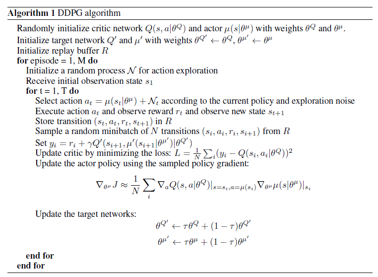
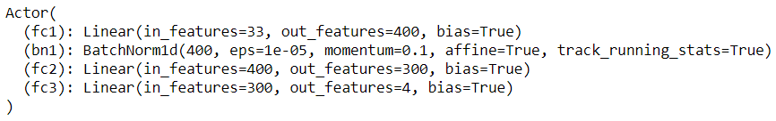
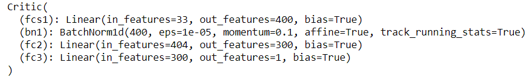
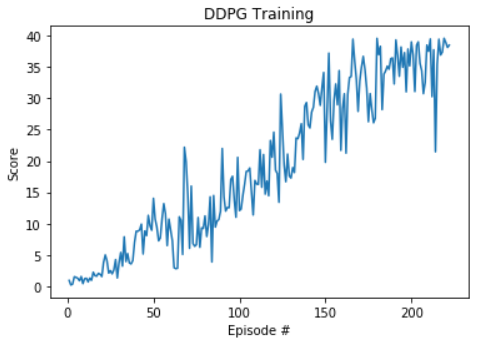

## Learning Algorithm

The learning algorithm used to train the agent was a Deep Deterministic Policy Gradient (DDPG) model trained with using Experience Replay Buffer and OU noise.

Deep deterministic policy gradient (DDPG) is a variant of DPG where the policy and critic Q are approximated with deep neural networks. DDPG is an off-policy algorithm, and samples trajectories from a replay buffer of experiences that are stored throughout training. DDPG also makes use of a target network, as in DQN.

The DDPG algorithm pseudo-code can be seen here:

## The Model Architecture for the Actor Network

- Inputs = State Space Size (33), Outputs = Action Space Size (4)

- Linear Layer 1 (inputs = 33, outputs = 400)
- Relu Activation Function
- Batch Normalization Layer
- Linear Layer 2 (inputs = 400, outputs = 300)
- Relu Activation Function
- Linear Layer 3 (inputs = 300, outputs = 4)
- Tanh Activation Function

## The Model Architecture for the Critic Network

- Inputs = State Space Size (33), Outputs = Action Space Size (4)

- Linear Layer 1 (inputs = 33, outputs = 400)
- Relu Activation Function
- Batch Normalization Layer
- Concatenation Layer(layers = 400 + 4 = 404)
- Linear Layer 2 (inputs = 404, outputs = 300)
- Relu Activation Function
- Linear Layer 3 (inputs = 300, outputs = 4)

## The Hyperparameters

- BUFFER_SIZE = int(1e6)  # replay buffer size
- BATCH_SIZE = 128        # minibatch size
- GAMMA = 0.99            # discount factor
- TAU = 1e-3              # for soft update of target parameters
- LR_ACTOR = 2e-4         # learning rate of the actor
- LR_CRITIC = 2e-4        # learning rate of the critic
- WEIGHT_DECAY = 0        # L2 weight decay
- THETA: 0.15             # revert speed to mean
- SIGMA: 0.1              # degree of volatility

## Plot of Rewards

Here we see a plot of rewards per training episode to illustrate that the agent is able to receive an average reward (over 100 episodes) of at least +30. The environment was solved in less than 222 episodes.

## Ideas for Future Work

There are many ways that this agent could be improved in the future. I will list a few ideas here that could be tested.

1. Experiment more with the actor and critic network architectures. More layers, more nodes, batchnorm, dropout.
2. Experiment more with the model training hyperparameters. Batch_size, LR, sigma, weight decay.
3. Try different models that have proven to be successful such as Trust Region Policy Optimization (TRPO), Truncated Natural Policy Gradient (TNPG), or Asynchronous Actor-Critic Agents (A3C).
4. Try implementing Prioritized Experience Replay.

## References

[CONTINUOUS CONTROL WITH DEEP REINFORCEMENT LEARNING](https://arxiv.org/abs/1509.02971)
